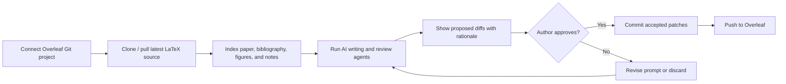
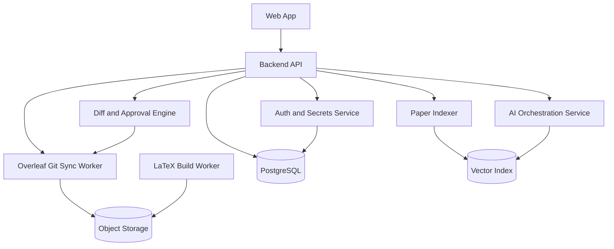

# RCA-AI

RCA-AI is an initial implementation of an AI-assisted research-paper writing platform. It helps researchers register Overleaf Git projects, clone/pull LaTeX manuscripts, index paper structure, and generate reviewable AI-assistance patches that can be approved before being pushed back to Overleaf.

This repository now contains runnable platform code, not only a concept document:

- `src/rca_ai/platform.py` exposes the application service layer.
- `src/rca_ai/git_sync.py` implements Overleaf Git clone, pull, branch, commit, and push primitives.
- `src/rca_ai/latex_indexer.py` extracts sections, citations, labels, figures, and tables from LaTeX projects.
- `src/rca_ai/ai_agents.py` provides the first deterministic writing/reviewer agents and the seam for model-backed agents.
- `src/rca_ai/server.py` exposes the browser UI and a small JSON API using the Python standard library.
- `src/rca_ai/web/` contains the interactive HTML, CSS, and JavaScript frontend.
- `src/rca_ai/cli.py` provides a command-line interface for local use and development.

## Quick start

```bash
python -m venv .venv
source .venv/bin/activate
pip install -e .
rca-ai --help
```

Run the test suite:

```bash
PYTHONPATH=src pytest -q
```


## Troubleshooting installation

### `TOMLDecodeError` while running `pip install -e .`

If `pip install -e .` fails with an error like `tomllib.TOMLDecodeError: Expected '=' after a key in a key/value pair`, your local `pyproject.toml` is malformed. This commonly happens after a manual GitHub conflict resolution leaves conflict text or prose in the TOML file.

Fastest fix: replace your local `pyproject.toml` with the known-good version below, then run `pip install -e .` again. From the repository root, paste this whole block:

```bash
cat > pyproject.toml <<'EOF'
[build-system]
requires = ["setuptools>=68"]
build-backend = "setuptools.build_meta"

[project]
name = "rca-ai"
version = "0.1.0"
description = "AI-assisted research-paper writing platform with Overleaf Git synchronization."
readme = "README.md"
requires-python = ">=3.10"
authors = [{ name = "RCA-AI" }]

[project.scripts]
rca-ai = "rca_ai.cli:main"

[tool.setuptools.packages.find]
where = ["src"]

[tool.pytest.ini_options]
pythonpath = ["src"]
testpaths = ["tests"]

[tool.setuptools.package-data]
rca_ai = ["web/*"]
EOF
```

If you prefer to inspect before replacing it, check the file around the reported line:

```bash
nl -ba pyproject.toml | sed -n '1,80p'
```

The file should contain valid TOML like this near the end:

```toml
[tool.pytest.ini_options]
pythonpath = ["src"]
testpaths = ["tests"]

[tool.setuptools.package-data]
rca_ai = ["web/*"]
```

Make sure there are no merge-conflict markers or stray text, especially lines like:

```text
< < < < < < < HEAD
= = = = = = =
> > > > > > > branch-name
```

After fixing the file, validate it and retry installation:

```bash
python3 - <<'PY'
import tomllib
from pathlib import Path
tomllib.loads(Path("pyproject.toml").read_text())
print("pyproject.toml is valid")
PY
pip install -e .
```


### `IndentationError` in `src/rca_ai/platform.py`

If `rca-ai --help`, `pytest`, or `rca-ai serve` fails with `IndentationError: unexpected indent` in `src/rca_ai/platform.py`, your local source file is malformed. This is usually another sign that the GitHub conflict resolution or a manual copy/paste changed indentation in the Python file.

First inspect the area Python reports:

```bash
nl -ba src/rca_ai/platform.py | sed -n '20,45p'
```

The method definitions inside `class ResearchPaperPlatform` should be indented exactly four spaces, for example:

```python
    def create_project(self, name: str, overleaf_git_url: str, default_branch: str = "main") -> Project:
        project = Project(name=name, overleaf_git_url=overleaf_git_url, default_branch=default_branch)
        return self.store.save_project(project)

    def create_demo_project(self, name: str = "Demo Research Paper") -> Project:
        """Create a local demo LaTeX project so users can try RCA-AI without Overleaf."""
```

If your file has extra spaces before `def create_demo_project`, conflict markers, or stray text, restore the file from Git and retry:

```bash
git restore src/rca_ai/platform.py
python3 -m py_compile src/rca_ai/platform.py
rca-ai --help
```

If `git restore` does not fix it because your branch already contains the bad conflict resolution, pull the latest fixed branch from GitHub or replace `src/rca_ai/platform.py` with the version from the repository before running the compile check again.


### `argparse.ArgumentError: conflicting subparser: serve`

If `rca-ai --help` fails with `argparse.ArgumentError: conflicting subparser: serve`, your local `src/rca_ai/cli.py` contains two `subcommands.add_parser("serve", ...)` blocks. This can happen if a conflict was resolved by keeping both versions of the `serve` command.

Inspect the CLI file:

```bash
nl -ba src/rca_ai/cli.py | sed -n '35,60p'
```

There should be exactly one `serve` parser block:

```python
    serve = subcommands.add_parser("serve", help="Run the browser UI and JSON API")
    serve.add_argument("--host", default="127.0.0.1")
    serve.add_argument("--port", type=int, default=8080)
```

If you see a second block such as `help="Run the minimal JSON HTTP API"`, delete the duplicate or restore the file from Git:

```bash
git restore src/rca_ai/cli.py
python3 -m py_compile src/rca_ai/cli.py
rca-ai --help
```

If `git restore` does not fix it because your branch already contains the duplicate, pull the latest fixed branch from GitHub or replace `src/rca_ai/cli.py` with the repository version.

## CLI usage

Register an Overleaf Git project:

```bash
rca-ai create-project "My Paper" "https://git.overleaf.com/YOUR_PROJECT_ID"
```

Clone the project. The token can be provided by environment variable so it does not appear in shell history:

```bash
export OVERLEAF_GIT_TOKEN="YOUR_OVERLEAF_GIT_TOKEN"
rca-ai clone PROJECT_ID
```

Index the manuscript:

```bash
rca-ai index PROJECT_ID --root-file main.tex
```

Generate a reviewable patch suggestion:

```bash
rca-ai suggest PROJECT_ID main.tex "Review the paper for clarity and missing structure." --agent-type reviewer
```

Run the browser UI and local JSON API:

```bash
rca-ai serve --host 127.0.0.1 --port 8080
```

Then open <http://127.0.0.1:8080> in your browser. You can click **Create demo paper** to try the full index-and-review workflow without connecting Overleaf first.

You can also check the API health endpoint:

```bash
curl http://127.0.0.1:8080/health
```


## Browser UI workflow

After running `rca-ai serve --host 127.0.0.1 --port 8080`, open <http://127.0.0.1:8080>. The page lets you:

1. Create a local demo LaTeX paper for immediate testing.
2. Register a real Overleaf Git project.
3. Clone a selected Overleaf project with a Git token.
4. Index `main.tex` and view detected sections, citations, labels, figures, and tables.
5. Generate a reviewer, outline, or clarity patch and inspect the unified diff in the browser.

The demo button creates a sample project under `.rca-ai/workspaces/` so you can interact with the app before adding Overleaf credentials.

## Product vision

Build a collaborative writing environment for academic teams that can:

- Pull LaTeX projects from Overleaf through Overleaf's Git integration.
- Analyze the manuscript structure, bibliography, figures, tables, and source files.
- Provide AI writing support for research-paper tasks such as outlining, related-work synthesis, section drafting, clarity edits, reviewer-style critique, contribution sharpening, and LaTeX-safe rewrites.
- Push approved changes back to Overleaf with clear Git commits so authors remain in control.
- Preserve academic integrity by separating author-provided evidence from AI-generated suggestions and by tracking every accepted edit.

## Overleaf integration approach

Overleaf projects can be treated as Git remotes when Git integration is available. The platform uses this path instead of relying on unofficial editor endpoints:

1. The user connects an Overleaf project by providing its Git URL and an Overleaf Git authentication token.
2. RCA-AI clones the project into an isolated workspace.
3. RCA-AI creates a working branch for AI-assisted edits.
4. AI agents propose LaTeX patches as reviewable diffs.
5. The user accepts, edits, or rejects each patch.
6. RCA-AI commits accepted changes and pushes them back to the Overleaf Git remote.

Important constraints:

- Overleaf cloud Git integration may require paid access for the project owner.
- The product should store tokens encrypted and should support token rotation and revocation.
- The first production version should avoid reverse-engineered Overleaf APIs and use documented Git workflows.

## Core user workflow



## MVP feature set

| Area | Implemented now | Next production step |
| --- | --- | --- |
| Project sync | Register projects and run Git clone, pull, branch, commit, and push commands | Add encrypted token vault, conflict UI, and background job retries. |
| LaTeX parsing | Detect root file, included files, sections, labels, citations, figures, and tables | Add AST-aware parsing and build-log line mapping. |
| AI drafting/revision | Generate deterministic reviewer/outline/comment diffs as a safe local fallback | Connect model provider, retrieval, and structured patch validation. |
| Review workflow | Return unified diffs with rationale and risk level | Add browser diff viewer and explicit accept/reject persistence. |
| Quality gates | Unit tests cover sync helpers, indexing, and patch generation | Add `latexmk`, bibliography checks, and push-blocking validation. |
| Audit trail | Domain models include request and patch IDs/timestamps | Persist prompts, model outputs, decisions, and Git commit mappings. |

## Suggested system architecture



### Service responsibilities

- **Web app:** project dashboard, manuscript viewer, chat/sidebar assistant, diff review, sync status, build logs, and activity history.
- **Backend API:** workspace management, project metadata, permissions, job dispatch, and audit logging.
- **Auth and secrets service:** encrypted storage for Overleaf Git tokens and future integrations such as Zotero, Semantic Scholar, or institutional SSO.
- **Overleaf Git sync worker:** clone, fetch, pull, branch, merge, commit, push, conflict detection, and retry handling.
- **Paper indexer:** parse LaTeX, BibTeX/BibLaTeX, PDF artifacts, figures, tables, equations, labels, and comments into searchable document chunks.
- **AI orchestration service:** coordinates specialized agents for drafting, revision, review, citation checking, and final polish.
- **Diff and approval engine:** converts AI output into minimal patches, validates changed LaTeX, and records author decisions.
- **LaTeX build worker:** compiles papers in sandboxed containers and surfaces errors with file/line context.

## AI agent design

| Agent | Purpose | Required guardrails |
| --- | --- | --- |
| Paper planner | Turns project notes into a paper outline and contribution narrative | Must ask for missing claims, results, and target venue. |
| Section drafter | Drafts sections from approved evidence and citations | Must not invent experimental results or references. |
| LaTeX editor | Applies localized wording, structure, and formatting edits | Must preserve commands, labels, citations, equations, and comments unless explicitly asked. |
| Reviewer | Simulates expert peer review and flags weaknesses | Must distinguish objective issues from subjective suggestions. |
| Citation auditor | Checks citation coverage, citation placement, and bibliography consistency | Must use retrieval-backed evidence for new reference suggestions. |
| Consistency checker | Finds mismatched terminology, numbers, claims, acronyms, and notation | Must cite the conflicting locations before suggesting changes. |

## Data model sketch

The implementation currently uses dependency-free dataclasses and local JSON storage so it can run immediately. These map cleanly to the production tables below:

```text
User
  id, email, name, role

Workspace
  id, owner_id, name, created_at

Project
  id, workspace_id, overleaf_git_url, default_branch, status, last_synced_at

ProjectSecret
  id, project_id, encrypted_token_ref, token_label, rotated_at

ManuscriptSnapshot
  id, project_id, git_commit_sha, branch, indexed_at, build_status

AIAssistRequest
  id, project_id, snapshot_id, agent_type, prompt, constraints, status

SuggestedPatch
  id, request_id, file_path, diff, rationale, risk_level, validation_status

PatchDecision
  id, patch_id, user_id, decision, edited_diff, decided_at
```

## Implementation roadmap

### Phase 1: Sync and review foundation

- Create the web dashboard and backend project model.
- Add encrypted Overleaf Git credentials.
- Implement clone, pull, branch, commit, and push jobs.
- Add a diff viewer and manual approval workflow.
- Add LaTeX build validation.

### Phase 2: High-quality AI writing assistance

- Add manuscript indexing and section-aware context retrieval.
- Add AI revision and reviewer agents.
- Generate minimal LaTeX-safe patches.
- Add audit logs for prompts, generated suggestions, approvals, and commits.

### Phase 3: Research quality and citation intelligence

- Integrate bibliography parsing and citation checks.
- Add retrieval-backed citation recommendations.
- Add terminology, notation, result, table, and figure consistency checks.
- Add target-venue checklists and formatting guidance.

### Phase 4: Collaboration and enterprise readiness

- Add teams, roles, comments, and assignment workflows.
- Add SSO, organization policy controls, and retention settings.
- Add self-hosted deployment options for sensitive research.
- Add analytics for writing progress and review readiness.

## Security and integrity requirements

- Encrypt Overleaf Git tokens at rest and redact them from logs.
- Run Git and LaTeX build operations in isolated sandboxes.
- Treat cloned research projects as confidential by default.
- Provide project-level retention controls and deletion workflows.
- Mark AI-authored suggestions clearly and require explicit human approval before pushing.
- Keep an immutable audit log of accepted changes and generated content.
- Prevent citation hallucination by requiring source-backed reference suggestions.

## Open product questions

- Should RCA-AI be a standalone web app, an Overleaf companion, or both?
- Which initial audience matters most: students, academic labs, enterprise R&D, or journal editorial teams?
- Should the MVP support only LaTeX, or should it also ingest Word and Markdown?
- Which citation sources should be supported first: Zotero, Crossref, Semantic Scholar, PubMed, arXiv, or institutional libraries?
- What level of AI autonomy is acceptable: comments only, suggested diffs, or auto-committed changes behind tests?

## External references

- Overleaf Git integration documentation: <https://docs.overleaf.com/integrations-and-add-ons/git-integration-and-github-synchronization/git>
- Overleaf Git authentication token documentation: <https://docs.overleaf.com/integrations-and-add-ons/git-integration-and-github-synchronization/git/git-integration-authentication-tokens>
