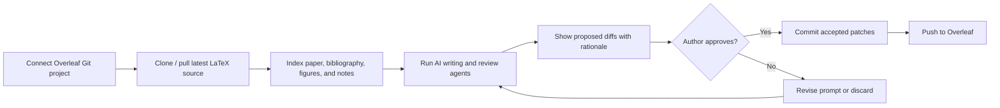
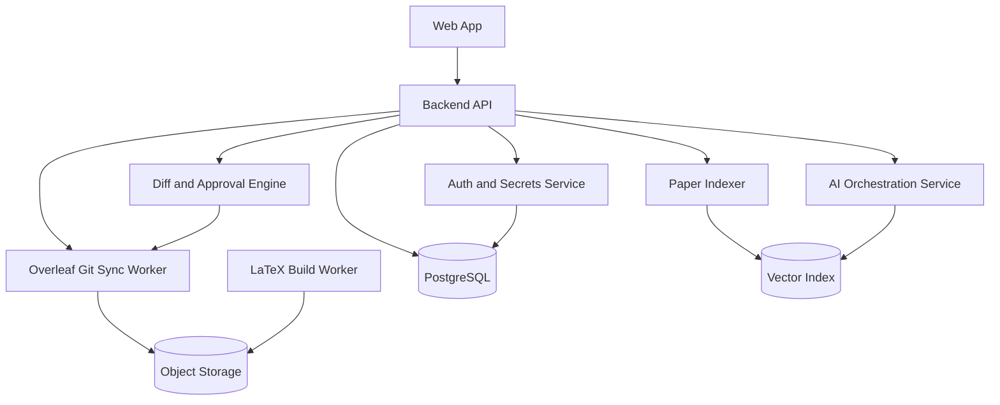

# RCA-AI

RCA-AI is a proposed AI-assisted research-paper writing platform that helps researchers draft, revise, review, cite, and polish high-quality manuscripts while keeping their LaTeX projects synchronized with Overleaf.

## Product vision

Build a collaborative writing environment for academic teams that can:

- Pull LaTeX projects from Overleaf through Overleaf's Git integration.
- Analyze the manuscript structure, bibliography, figures, tables, and source files.
- Provide AI writing support for research-paper tasks such as outlining, related-work synthesis, section drafting, clarity edits, reviewer-style critique, contribution sharpening, and LaTeX-safe rewrites.
- Push approved changes back to Overleaf with clear Git commits so authors remain in control.
- Preserve academic integrity by separating author-provided evidence from AI-generated suggestions and by tracking every accepted edit.

## Overleaf integration approach

Overleaf projects can be treated as Git remotes when Git integration is available. The platform should use this path instead of relying on unofficial editor endpoints:

1. The user connects an Overleaf project by providing its Git URL and an Overleaf Git authentication token.
2. RCA-AI clones the project into an isolated workspace.
3. RCA-AI creates a working branch for AI-assisted edits.
4. AI agents propose LaTeX patches as reviewable diffs.
5. The user accepts, edits, or rejects each patch.
6. RCA-AI commits accepted changes and pushes them back to the Overleaf Git remote.

Important constraints:

- Overleaf cloud Git integration may require paid access for the project owner.
- The product should store tokens encrypted and should support token rotation and revocation.
- The first production version should avoid reverse-engineered Overleaf APIs and use documented Git workflows.

## Core user workflow



## MVP feature set

| Area | MVP capability | Notes |
| --- | --- | --- |
| Project sync | Clone, pull, branch, commit, and push Overleaf Git projects | Start with one project per workspace. |
| LaTeX parsing | Detect `main.tex`, included files, sections, labels, citations, figures, and tables | Use AST-aware parsing where possible and fall back to conservative text patches. |
| AI drafting | Generate outlines, abstracts, introductions, related-work drafts, and conclusion drafts | Require user-provided claims, results, and citation context. |
| AI revision | Improve clarity, flow, grammar, structure, and concision without changing meaning | Return diffs rather than replacing whole files blindly. |
| Reviewer agent | Produce novelty, clarity, methodology, threat-to-validity, and contribution critiques | Provide actionable comments linked to sections. |
| Citation support | Identify missing citations, unused citations, weak citation contexts, and bibliography issues | Do not fabricate references; require retrieval-backed suggestions. |
| Quality gates | Run LaTeX build checks, linting, broken-reference checks, and bibliography checks | Block push on unsafe or uncompilable changes unless overridden. |
| Audit trail | Track prompts, generated suggestions, accepted patches, commits, and author approvals | Needed for trust, reproducibility, and institutional review. |

## Suggested system architecture



### Service responsibilities

- **Web app:** project dashboard, manuscript viewer, chat/sidebar assistant, diff review, sync status, build logs, and activity history.
- **Backend API:** workspace management, project metadata, permissions, job dispatch, and audit logging.
- **Auth and secrets service:** encrypted storage for Overleaf Git tokens and future integrations such as Zotero, Semantic Scholar, or institutional SSO.
- **Overleaf Git sync worker:** clone, fetch, pull, branch, merge, commit, push, conflict detection, and retry handling.
- **Paper indexer:** parse LaTeX, BibTeX/BibLaTeX, PDF artifacts, figures, tables, equations, labels, and comments into searchable document chunks.
- **AI orchestration service:** coordinates specialized agents for drafting, revision, review, citation checking, and final polish.
- **Diff and approval engine:** converts AI output into minimal patches, validates changed LaTeX, and records author decisions.
- **LaTeX build worker:** compiles papers in sandboxed containers and surfaces errors with file/line context.

## AI agent design

| Agent | Purpose | Required guardrails |
| --- | --- | --- |
| Paper planner | Turns project notes into a paper outline and contribution narrative | Must ask for missing claims, results, and target venue. |
| Section drafter | Drafts sections from approved evidence and citations | Must not invent experimental results or references. |
| LaTeX editor | Applies localized wording, structure, and formatting edits | Must preserve commands, labels, citations, equations, and comments unless explicitly asked. |
| Reviewer | Simulates expert peer review and flags weaknesses | Must distinguish objective issues from subjective suggestions. |
| Citation auditor | Checks citation coverage, citation placement, and bibliography consistency | Must use retrieval-backed evidence for new reference suggestions. |
| Consistency checker | Finds mismatched terminology, numbers, claims, acronyms, and notation | Must cite the conflicting locations before suggesting changes. |

## Data model sketch

```text
User
  id, email, name, role

Workspace
  id, owner_id, name, created_at

Project
  id, workspace_id, overleaf_git_url, default_branch, status, last_synced_at

ProjectSecret
  id, project_id, encrypted_token_ref, token_label, rotated_at

ManuscriptSnapshot
  id, project_id, git_commit_sha, branch, indexed_at, build_status

AIAssistRequest
  id, project_id, snapshot_id, agent_type, prompt, constraints, status

SuggestedPatch
  id, request_id, file_path, diff, rationale, risk_level, validation_status

PatchDecision
  id, patch_id, user_id, decision, edited_diff, decided_at
```

## Implementation roadmap

### Phase 1: Sync and review foundation

- Create the web dashboard and backend project model.
- Add encrypted Overleaf Git credentials.
- Implement clone, pull, branch, commit, and push jobs.
- Add a diff viewer and manual approval workflow.
- Add LaTeX build validation.

### Phase 2: High-quality AI writing assistance

- Add manuscript indexing and section-aware context retrieval.
- Add AI revision and reviewer agents.
- Generate minimal LaTeX-safe patches.
- Add audit logs for prompts, generated suggestions, approvals, and commits.

### Phase 3: Research quality and citation intelligence

- Integrate bibliography parsing and citation checks.
- Add retrieval-backed citation recommendations.
- Add terminology, notation, result, table, and figure consistency checks.
- Add target-venue checklists and formatting guidance.

### Phase 4: Collaboration and enterprise readiness

- Add teams, roles, comments, and assignment workflows.
- Add SSO, organization policy controls, and retention settings.
- Add self-hosted deployment options for sensitive research.
- Add analytics for writing progress and review readiness.

## Security and integrity requirements

- Encrypt Overleaf Git tokens at rest and redact them from logs.
- Run Git and LaTeX build operations in isolated sandboxes.
- Treat cloned research projects as confidential by default.
- Provide project-level retention controls and deletion workflows.
- Mark AI-authored suggestions clearly and require explicit human approval before pushing.
- Keep an immutable audit log of accepted changes and generated content.
- Prevent citation hallucination by requiring source-backed reference suggestions.

## Open product questions

- Should RCA-AI be a standalone web app, an Overleaf companion, or both?
- Which initial audience matters most: students, academic labs, enterprise R&D, or journal editorial teams?
- Should the MVP support only LaTeX, or should it also ingest Word and Markdown?
- Which citation sources should be supported first: Zotero, Crossref, Semantic Scholar, PubMed, arXiv, or institutional libraries?
- What level of AI autonomy is acceptable: comments only, suggested diffs, or auto-committed changes behind tests?

## External references

- Overleaf Git integration documentation: <https://docs.overleaf.com/integrations-and-add-ons/git-integration-and-github-synchronization/git>
- Overleaf Git authentication token documentation: <https://docs.overleaf.com/integrations-and-add-ons/git-integration-and-github-synchronization/git/git-integration-authentication-tokens>
